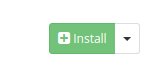
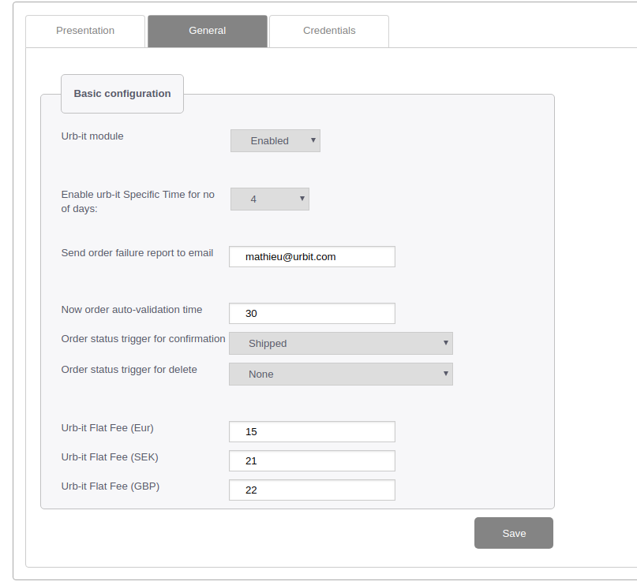
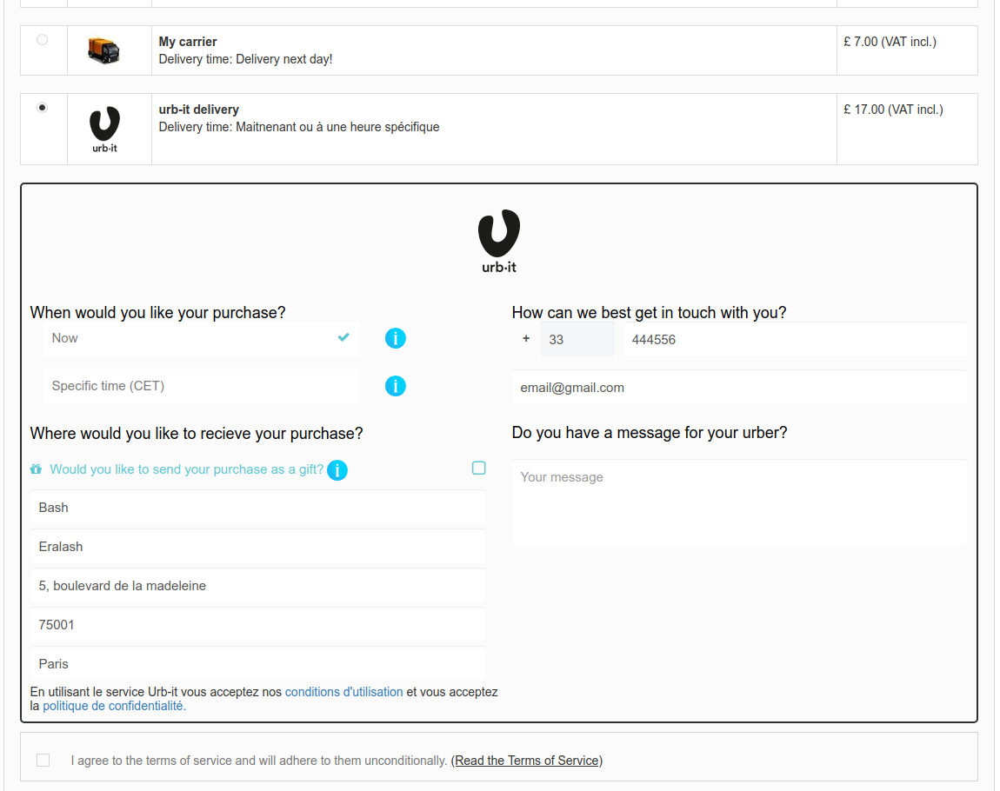
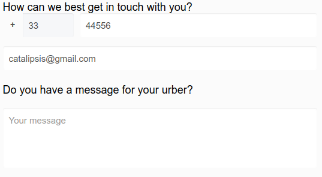
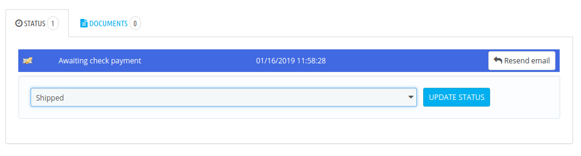

# Urb-it shipping plugin for PrestaShop
[](https://www.gnu.org/licenses/gpl-3.0)

## Table of Contents

- [ Installation ](#installation)
- [ Usage ](#usage)
  - [ Module settings ](#module-settings)
    - [ Credentials settings ](#credentials-settings)
    - [ General settings ](#general-settings)
  - [ Placing an order with Urb-it shipping ](#placing-an-order-with-urb-it-shipping)
  - [ Checking just received order ](#checking-just-received-order)
- [ Support ](#support)
- [ Contributing ](#contributing)

## Installation


Please follow these steps:


1. Click “Clone or download” (green button on the right side).
2. Push a “Download ZIP” button and the archive will be downloaded to your local machine.

```
In PrestaShop, the folder with the module must have the same name as the module itself, 
otherwise the module is not displayed in the list after the archive is loaded.
```

3. Unzip `PrestaShop-Urbit-Delivery-master.zip`.
4. Rename `PrestaShop-Urbit-Delivery-master` folder to `urbit`.
5. Add `urbit` folder to zip archive.


6. Go to your PrestaShop’s admin panel.
7. Go to `Modules and Services -> Modules and Services`


8. Click on the **Add a new module** button


9. Choose the archive with module and click **Upload this module**


10. Find the module in your module list. You can set Authors filter to “urb-it”, or use search.


11. Click on the **Install** button.



12. After successful installation you will see the default “Presentation” tab of the module config.


## Usage

### Module settings

1. Go to your PrestaShop’s admin panel.
2. Go to `Modules and Services -> Modules and Services`
3. Find the module in your module list. You can set Authors filter to “urb-it”, or use search.


4. Click on the **Configure** button


#### Credentials settings

The module has a close interaction with Urb-it API so it is impossible to use it without environment credentials. 


There are two environments with different credentials: **Production** and **Test**.

- `Urb-it API Key` - key received from Urb-it

- `Bearer JWT Token` - token received from Urb-it

- `Production Environment API URL`:  https://api.urb-it.com

- `Test/Sandbox Environment API URL`:  https://sandbox.urb-it.com

```
Check “Enable test mode” if you want to use a sandbox environment.
```

#### General settings




- `Enable urb-it Specific Time for no of days` - the number of the next days on which delivery can be arranged.

- `Send order failure report to email` - email, which will receive error messages.

- `Now order auto-validation time (in minutes)` - the time after which the message will be sent to Urbit that the order is ready for delivery. (You can leave it blank and use only Order status trigger for confirmation).

- `Order status trigger for confirmation` - order status, after which a message will be send to Urbit that the order is ready for delivery.

- `Order status trigger for delete` - deletion of stored local customer data (for GDPR).

- `Urb-it Flat Fee` - shipping cost in different currencies.

### Placing an order with Urb-it shipping

To make and order with Urb-it just follow the straight steps:

1. Go to the storefront.
2. Place some products to basket.
3. Go to checkout.
4. Choose **urb-it delivery** on the checkout’s shipping step.



5. Choose the delivery date.

`Now` - products will be delivered as soon as possible

`Specific time (CET)` - you can choose a specific delivery date 


All available delivery dates and time took from the Urb-it API according to X-API-Key (individual for each customer). The administrator can limit the number of possible days for delivery in the module configuration (*“Enable urb-it Specific Time for no of days”* selectbox)


6. Fill in the customer’s name and address information.


By default, data is copied from the customer’s address.

The entered address is validated by Urb-it API. You will see validation error if the address is malformed or is outside the delivery area.


7. Fill in phone number (required), email (required) and message for urber (optional).



8. Go to the next checkout’s step and confirm your order. 


### Checking just received order

To see the details of the order that we just made, go back to the PrestaShop’s admin panel.

1. In the left menu bar select `Orders -> Orders`.


2. Choose your order from the list 
3. Go to order details page


You can see Urb-it delivery information in **URB-IT TIME AND ADDRESS** tab.


**There you have two options:**
1. Wait for the order will be sent to Urb-it by the time picked at checkout (scheduled by the cron task).
2. In case when order prepared earlier you can mark it as ready to ship by changing the order status to one specified in Urb-it configuration. Then order will be triggered (cron task will be dropped) and order will go to Urb-it (it will notify Urb-it that it is ready to be shipped).

**To trigger the order please follow the next steps:**



1. Switch the order status to the “trigger” status.
2. Update order by clicking “Update status”.

## Support
If you have any issues with this extension, contact us at support@urbit.com

## Contributing 
Any contribution is highly appreciated. The best way to contribute code is to open a pull request on GitHub.


